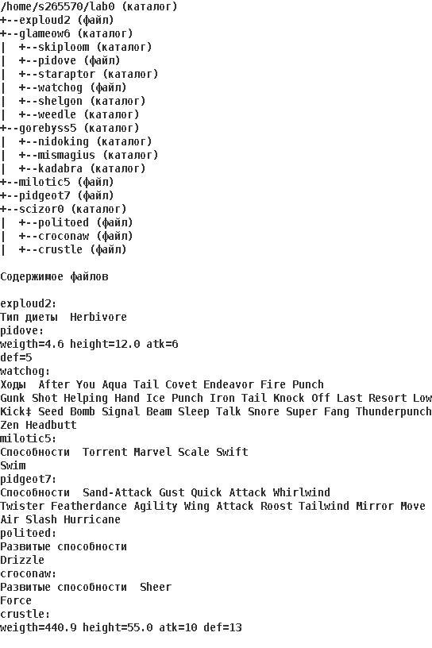
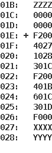

# Лабораторная №1 #

1. Создать приведенное в варианте дерево каталогов и файлов с содержимым. В качестве корня дерева использовать каталог `lab0` своего домашнего каталога. Для создания и навигации по дереву использовать команды: `mkdir, echo, cat, touch, ls, pwd, cd, more, cp, rm, rmdir, mv`.



2. Установить согласно заданию права на файлы и каталоги при помощи команды `chmod`, используя различные способы указания прав.
    - exploud2: права 666
    - glameow6: владелец должен читать, записывать директорию и переходить в нее; группа-владелец должна читать и записывать директорию; остальные пользователи должны читать директорию
    - skiploom: права 751
    - pidove: владелец должен читать и записывать файл; группа-владелец должна записывать файл; остальные пользователи должны не иметь никаких прав
    - staraptor: владелец должен записывать директорию и переходить в нее; группа-владелец должна читать и записывать директорию; остальные пользователи должны записывать директорию и переходить в нее
    - watchog: права 066
    - shelgon: права 700
    - weedle: -wx-wxr-x
    - gorebyss5: права 315
    - nidoking: права 751
    - mismagius: права 751
    - kadabra: rwxr-x-w-
    - milotic5: ---rw--w-
    - pidgeot7: rw-r-----
    - scizor0: владелец должен читать, записывать директорию и переходить в нее; группа-владелец должна читать директорию и переходить в нее; остальные пользователи должны записывать директорию и переходить в нее
    - politoed: rw----r--
    - croconaw: владелец должен читать файл; группа-владелец должна не иметь никаких прав; остальные пользователи должны не иметь никаких прав
    - crustle: ---r--rw-

3. Скопировать часть дерева и создать ссылки внутри дерева согласно заданию при помощи команд `cp` и `ln`, а также комманды `cat` и перенаправления ввода-вывода.
    - cоздать жесткую ссылку для файла exploud2 с именем lab0/glameow6/watchogexploud
    - создать символическую ссылку c именем Copy_97 на директорию gorebyss5 в каталоге lab0
    - cоздать символическую ссылку для файла pidgeot7 с именем lab0/scizor0/croconawpidgeot
    - скопировать содержимое файла exploud2 в новый файл lab0/scizor0/croconawexploud
    - скопировать рекурсивно директорию gorebyss5 в директорию lab0/glameow6/weedle
    - объеденить содержимое файлов lab0/scizor0/croconaw, lab0/scizor0/croconaw, в новый файл lab0/milotic5_42
    - скопировать файл milotic5 в директорию lab0/gorebyss5/mismagius

4. Используя команды `cat, wc, ls, head, tail, echo, sort, grep` выполнить в соответствии с вариантом задания поиск и фильтрацию файлов, каталогов и содержащихся в них данных.
    - Подсчитать количество строк содержимого файла pidgeot7, результат записать в тот-же файл, ошибки доступа перенаправить в файл в директории /tmp
    - Вывести два первых элемента рекурсивного списка имен и атрибутов файлов в директории lab0, список отсортировать по убыванию даты доступа к файлу, подавить вывод ошибок доступа 
    - Рекурсивно вывести содержимое файлов из директории lab0, имя которых начинается на 'c', строки отсортировать по имени z->a, ошибки доступа перенаправить в файл в директории /tmp
    - Вывести содержимое файлов: pidove, watchog, politoed, croconaw с номерами строк, строки отсортировать по имени a->z, ошибки доступа не подавлять и не перенаправлять
    - Вывести рекурсивно список имен и атрибутов файлов в директории lab0, заканчивающихся на символ 'e', список отсортировать по возрастанию количества жестких ссылок, ошибки доступа не подавлять и не перенаправлять
    - Подсчитать количество символов содержимого файла exploud2, результат записать в файл в директории /tmp, ошибки доступа перенаправить в файл в директории /tmp

5. Выполнить удаление файлов и каталогов при помощи команд `rm` и `rmdir` согласно варианту задания.
    - Удалить файл pidgeot7
    - Удалить файл lab0/scizor0/crustle
    - удалить символические ссылки lab0/scizor0/croconawpidge*
    - удалить жесткие ссылки lab0/glameow6/watchogexplo*
    - Удалить директорию scizor0
    - Удалить директорию lab0/gorebyss5/mismagius

# Лабораторная №2 #

По выданному преподавателем варианту определить функцию, вычисляемую программой, область представления и область допустимых значений исходных данных и результата, выполнить трассировку программы, предложить вариант с меньшим числом команд. При выполнении работы представлять результат и все операнды арифметических операций знаковыми числами, а логических операций набором из шестнадцати логических значений.
    


# Лабораторная №3 #

По выданному преподавателем варианту восстановить текст заданного варианта программы, определить предназначение и составить описание программы, определить область представления и область допустимых значений исходных данных и результата, выполнить трассировку программы.


# Лабораторная №4 #

По выданному преподавателем варианту восстановить текст заданного варианта программы и подпрограммы (программного комплекса), определить предназначение и составить его описание, определить область представления и область допустимых значений исходных данных и результата, выполнить трассировку программного комплекса.


# Лабораторная №5 #

По выданному преподавателем варианту разработать программу асинхронного обмена данными с внешним устройством. При помощи программы осуществить ввод или вывод информации, используя в качестве подтверждения данных сигнал (кнопку) готовности ВУ.
```
1. Программа осуществляет асинхронный ввод данных с ВУ-2
2. Программа начинается с адреса 57D16. Размещаемая строка находится по адресу 71816. Для реализации чтения или записи строки необходимо использовать индексную ячейку 916.
3. Строка должна быть представлена в кодировке ISO-8859-5.
4. Формат представления строки в памяти: АДР1: СИМВ1 СИМВ2 АДР2: СИМВ3 СИМВ4 ... СТОП_СИМВ.
5. Ввод или вывод строки должна быть завершен по символу c кодом 0A (NL)
```

# Лабораторная №6 #

По выданному преподавателем варианту разработать и исследовать работу комплекса программ обмена данными в режиме прерывания программы. Основная программа должна изменять содержимое заданной ячейки памяти (Х), которое должно быть представлено как знаковое число. Область допустимых значений изменения Х должна быть ограничена заданной функцией F(X) и конструктивными особенностями регистра данных ВУ (8-ми битное знаковое представление). Программа обработки прерывания должна выводить на ВУ модифицированное значение Х в соответствии с вариантом задания, а также игнорировать все необрабатываемые прерывания.

```
1. Основная программа должна инкрементировать содержимое X (ячейки памяти с адресом 03D16) в цикле.
2. Обработчик прерывания должен по нажатию кнопки готовности ВУ-1 осуществлять вывод результата вычисления функции F(X)=-3X+1 на данное ВУ, a по нажатию кнопки готовности ВУ-2 выполнить операцию побитового 'И' содержимого РД данного ВУ и Х
3. Если Х оказывается вне ОДЗ при выполнении любой операции по его изменению, то необходимо в Х записать минимальное по ОДЗ число.
```